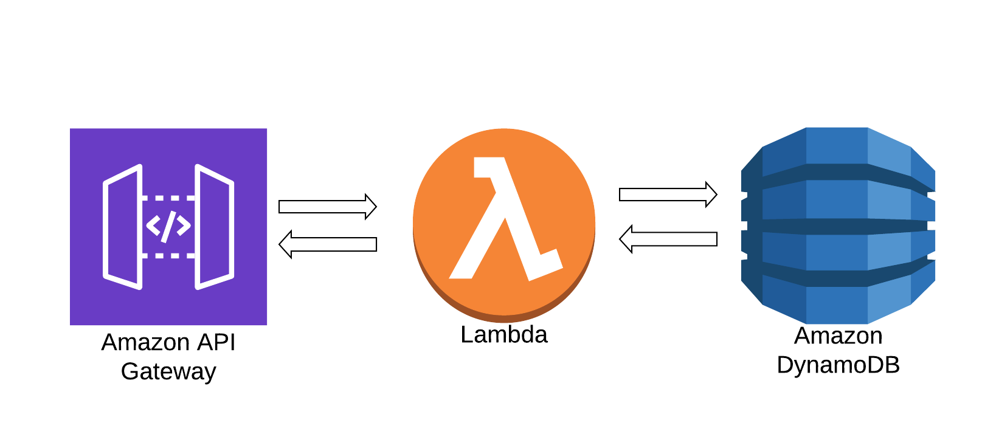
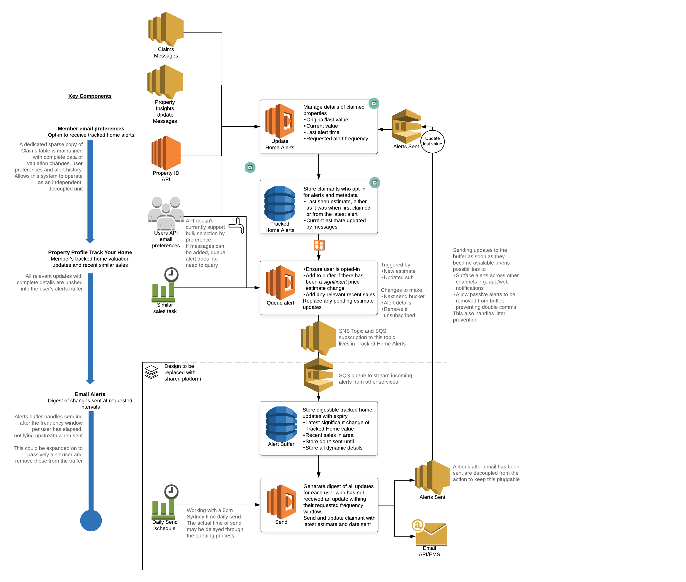

## What Is Serverless ⚡️

*from the serverless website*

Serverless is a framework that we use to build, test and deploy serverless applications in a streamlined and standardised manner. One of the good things is that it is provider agnostic, so not only on AWS but azure and google cloud as well.

Serverless abstracts away the most menial parts of building an application, leaving developers free to actually spend their days coding.

What this means is that developers can single-handedly build apps that handle production-ready traffic. They don’t have to actively manage scaling for their applications. They don't have to provision servers, or pay for resources that go unused. They can just get projects off the ground with small, agile teams.

So today we are going to setup a serverless API to save notes. We will setup lambda functions to save the notes in a dynamodb table and we will expose the lambdas as restful endpoints with API gateway.





### Setup

Installing Serverless framework

```
npm install -g serverless
```

To check the version
```
sls -v
``` 
---
&nbsp;

## Let's Start 🛠

Let's make a serverless application

``` 
mkdir serverless-app 

cd serverless-app

sls create --template aws-nodejs -n yourName-serverless-api

```

### Deploy 🚀

### Update the region and stage

First we need to update the region we want to deploy to. Lets add stage and tag info while we are at it

#### **`serverless.yml`**
```yaml
provider:
  name: aws
  runtime: nodejs10.x
  region: ap-southeast-2
  stage: dev
  stackTags:
    Application: yourName-serverless-api
    Environment: ${self:provider.stage}
    Team: yourTeam
```

Let's deploy this to AWS

```
saml2aws login

export AWS_PROFILE="domain-sandbox"

serverless deploy
```

Now let's login to the AWS console and look at what we setup

---
&nbsp;

## Exposing our lambda function

Now let's expose our lambda function with a API gateway endpoint

#### **`serverless.yml`**
```yaml
functions:
  hello:
    handler: handler.hello
    events:
      - http:
          path: hello
          method: get
          cors: true
```

Now let's deploy

`sls deploy`

---
&nbsp;

## Specifying config at the provider level ⚙️

#### **`serverless.yml`**
```yaml
provider:
  name: aws
  runtime: nodejs10.x
  memorySize: 128
  timeout: 3
```
---
&nbsp;

## Plugins 🔌

Plugins are custom code to add functionality

Let's add a plugin to test our stack offline

```
npm init -y

yarn add --dev serverless-offline
```


#### **`serverless.yml`**
```yaml
plugins:
  - serverless-offline
```
Then run in the terminal
```
sls offline
```

Now test on localhost:3000/hello

---
&nbsp;

## Setting up a dynamoDb 🗂

We setup our dynamo db in serverless.yml

#### **`serverless.yml`**
```yaml
resources:
  Resources:
    NotesTable:
      Type: AWS::DynamoDB::Table
      DeletionPolicy: Delete
      Properties:
        TableName: ${self:provider.environment.NOTES_TABLE}
        AttributeDefinitions:
          - AttributeName: note_id
            AttributeType: S
        KeySchema:
          - AttributeName: note_id
            KeyType: HASH
        ProvisionedThroughput:
          ReadCapacityUnits: 1
          WriteCapacityUnits: 1
```
Let's add environment variable at the provider level

```yaml
provider:
  name: aws
  runtime: nodejs10.x
  memorySize: 128
  timeout: 3
  environment: 
    NOTES_TABLE: ${self:service}-${self:provider.stage}
```
Now let's deploy

`sls deploy`

We can check in AWS console to see the table

---
&nbsp;

## Adding the handlers for our functions

Now let's add the handlers to interact with our DB

So let's create a file for our function

`add-note.js` and `get-notes.js`

We need to install our dependencies
```
yarn add aws-sdk uuid
```

Then we can write some boilerplate code

#### **`add-note.js`**
```javascript
const AWS = require('aws-sdk');
AWS.config.update({ region: 'ap-southeast-2' });

const dynamodb = new AWS.DynamoDB.DocumentClient();
const tableName = process.env.NOTES_TABLE;

exports.handler = async (event) => {
    try {
        return {
            statusCode: 200,
            body: JSON.stringify()
        };
    } catch (err) {
        console.log("Error", err);
        return {
            statusCode: err.statusCode ? err.statusCode : 500,
            body: JSON.stringify({
                message: "error"
            })
        };
    }
}
```
Let's copy this code over to `get-notes.js` and we will finish it later

First let's finish off the code for the add-note handler

#### **`add-note.js`**
```javascript
/**
 * Route: POST /note
 */

const AWS = require('aws-sdk');
AWS.config.update({ region: 'ap-southeast-2' });

const uuidv4 = require('uuid/v4');

const dynamodb = new AWS.DynamoDB.DocumentClient();
const tableName = process.env.NOTES_TABLE;

exports.handler = async (event) => {
    try {
        let item = JSON.parse(event.body);
        item.note_id = uuidv4()

        let data = await dynamodb.put({
            TableName: tableName,
            Item: item
        }).promise();

        return {
            statusCode: 200,
            body: JSON.stringify(item)
        };
    } catch (err) {
        console.log("Error", err);
        return {
            statusCode: err.statusCode ? err.statusCode : 500,
            body: JSON.stringify({
                message: "error"
            })
        };
    }
}
```
---
&nbsp;

## Adding IAM permissions

Now our lambda handlers are going to need appropriate permissions to interact with our dynamo db

#### **`serverless.yml`**
```yaml
provider:
  name: aws
  runtime: nodejs10.x
  region: ap-southeast-2
  stage: dev
  memorySize: 128
  timeout: 3
  environment: 
    NOTES_TABLE: ${self:service}-${self:provider.stage}
  iamRoleStatements:
    - Effect: Allow
      Action: 
        - dynamodb:PutItem
        - dynamodb:Query
      Resource: "arn:aws:dynamodb:${self:provider.region}:*:table/${self:provider.environment.NOTES_TABLE}"
```
---
&nbsp;

## Adding the lambda handlers to serverless.yml

Now we are ready to define our lambda function and the corresponding endpoint.

#### **`serverless.yml`**
```yaml
functions:
  add-note:
    handler: add-note.handler
    description: POST /note
    events:
      - http:
          path: note
          method: post
          cors: true
```
Now we can test the application locally with serverless-offline

`sls offline`

We can test with the following request
```
POST localhost:3000/note
Content-Type: application/json

    {
	"user_id": "id1",
	"user_name": "name",
	"title": "my note",
	"content": "Serverless rocks"
    }
```
---
&nbsp;

## Finishing the get-notes handler

Now lets finish our get notes handler

#### **`get-notes.js`**
```javascript
/**
 * Route: GET /notes
 */

const AWS = require('aws-sdk');
AWS.config.update({ region: 'ap-southeast-2' });

const dynamodb = new AWS.DynamoDB.DocumentClient();
const tableName = process.env.NOTES_TABLE;

exports.handler = async (event) => {
    try {
        let params = {
            TableName: tableName,
        };
        let data = await dynamodb.scan(params).promise();

        return {
            statusCode: 200,
            body: JSON.stringify(data)
        };
    } catch (err) {
       console.log("Error", err);
        return {
            statusCode: err.statusCode ? err.statusCode : 500,
            body: JSON.stringify({
                message: "error"
            })
        };
    }
}

```

Now we are ready to define our lambda function and the corresponding endpoint
Let's define the function in serverless.yml

#### **`serverless.yml`**
```yaml
functions:
  get-notes:
    handler: get-notes.handler
    description: GET /note
    events:
      - http:
          path: notes
          method: get
          cors: true
```

Now lets test it

```
GET localhost:3000/notes
```

### Removing a stack

Removing a stack is easy

```
sls remove
```


---
&nbsp;

# WE ARE DONE!! YOU ROCK 🎸🤘🎉

## More resources

## [Serverless website](https://serverless.com/)

## [fe-lambda-boilerplate-generator](https://github.com/domain-group/fe-lambda-boilerplate-generator)


## [Domain auction-results-manager](https://github.com/domain-group/auction-results-manager)
